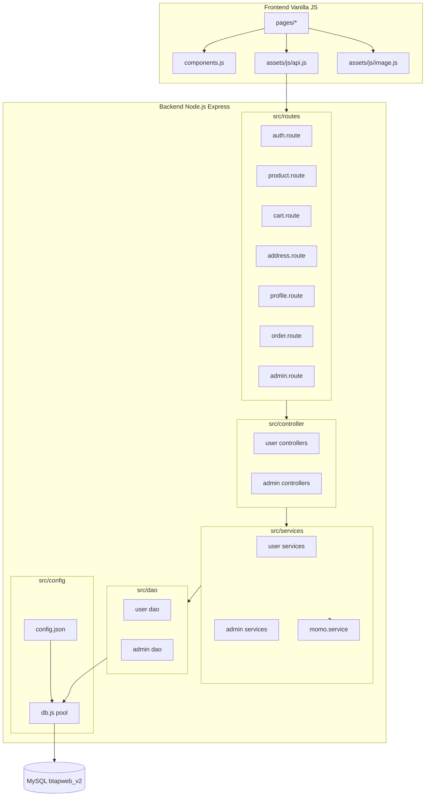
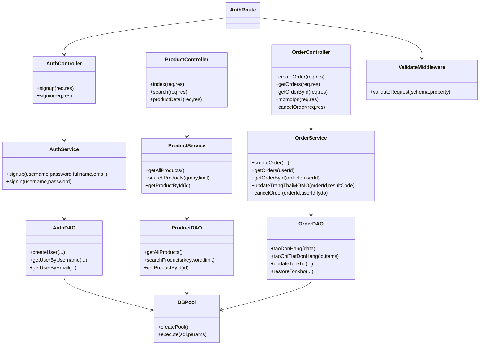
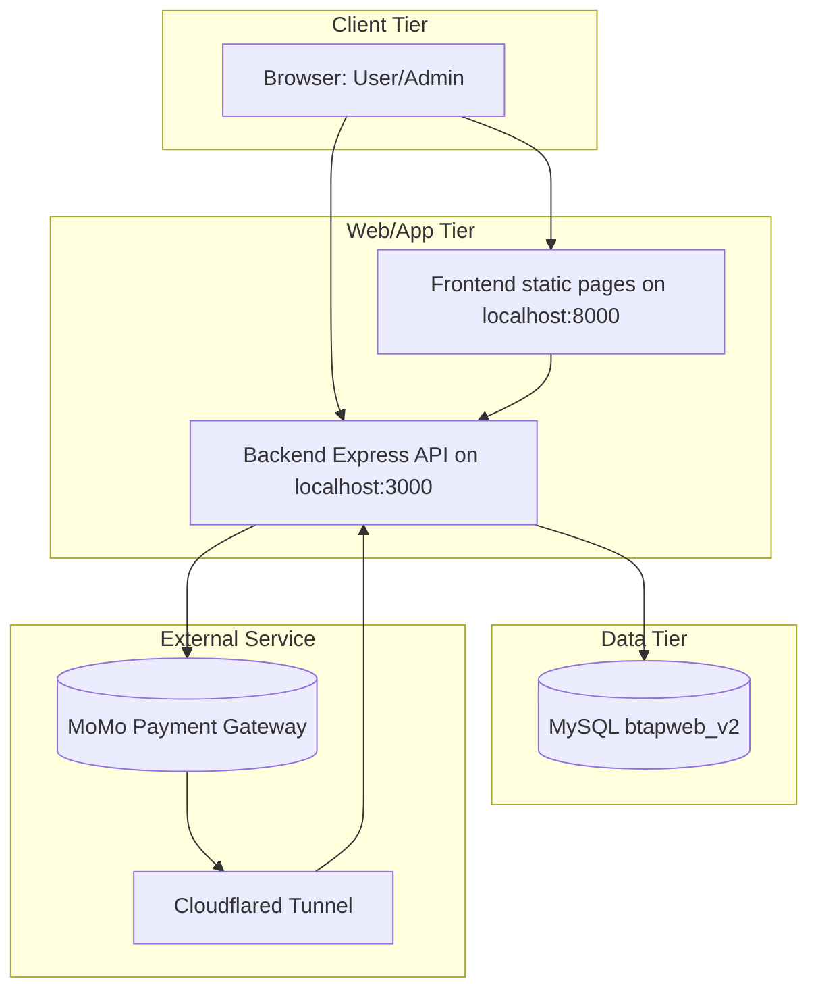

# BAO CAO DO AN CHI TIET - HE THONG BACKEND/API + FRONTEND BAN HANG

## Thong tin chung
- Ten du an: Backend API + Frontend ban hang thoi trang (user + admin)
- Repository: backend_api_kttkpm
- Nhanh hien tai: testmomo
- Cong nghe chinh: Node.js, Express, MySQL, Vanilla JS
- Dinh huong bao cao: Khoang 20 trang A4 (co day du ly thuyet + phan project)

---

## 0) Trich xuat yeu cau tu anh de bai

Noi dung trong anh yeu cau bao cao gom 2 phan:

### A. Ly thuyet
- Noi ve cong nghe duoc su dung trong project mon.
- Noi ve cong cu su dung trong qua trinh phat trien.

### B. Project
- Noi ve kien truc xay dung he thong.
- Noi ve cac chuc nang da xay dung.
- Thong ke so API.
- Trinh bay ket qua xay dung phan mem.

### Rang buoc do dai
- Tom gon trong khoang 20 trang.

### Bat buoc
- Co 1 bang phan cong cong viec.

### Bo sung theo yeu cau hien tai
- Them cac bieu do:
  - Bieu do goi (package)
  - Bieu do thanh phan (component)
  - Bieu do lop (class)
  - Bieu do trien khai (deployment)

---

## 1) Tong quan nhanh bang so lieu codebase

So lieu duoi day duoc thong ke truc tiep tu source hien tai:

| Hang muc | So lieu |
|---|---:|
| So nhom route API | 7 |
| Tong endpoint API | 44 |
| So bang du lieu (sql_v2.sql) | 14 |
| So route file | 7 |
| So controller file | 14 |
| So service file | 16 |
| So dao file | 13 |
| So validation file | 4 |
| So file HTML frontend | 31 |
| So file JS frontend | 27 |
| So file CSS frontend | 31 |

### 1.1 Thong ke API theo module

| Module | So endpoint |
|---|---:|
| auth.route.js | 2 |
| product.route.js | 4 |
| cart.route.js | 4 |
| address.route.js | 6 |
| profile.route.js | 3 |
| order.route.js | 5 |
| admin.route.js | 20 |
| **Tong** | **44** |

### 1.2 Danh sach bang du lieu
- bienthesp
- chitietdonhang
- chitietphieunhap
- danhgia
- danhmuc
- diachigiaohang
- donhang
- giohang
- hinhanh_sanpham
- lichsu_donhang
- phieunhap
- sanpham
- users
- voucher

---

## PHAN A - LY THUYET (CONG NGHE + CONG CU)

## A1) Cong nghe backend

## A1.1 Node.js + ES Modules
- Du an su dung `type: module` trong package.json.
- Loi ich:
  - To chuc import/export ro rang.
  - Phu hop mo hinh code hien dai.
  - De tach layer (routes/controllers/services/dao).

## A1.2 Express.js
- Dung Express de xay dung REST API.
- Entry point: `index.js`.
- Cac route duoc mount theo prefix:
  - `/api/auth`
  - `/api/products`
  - `/api/cart`
  - `/api/address`
  - `/api/orders`
  - `/api/profile`
  - `/api/admin`

## A1.3 MySQL + mysql2/promise
- CSDL MySQL, config trong `src/config/config.json`.
- Ket noi qua pool (`src/config/db.js`) voi mysql2/promise.
- Uu diem:
  - Hieu nang tot cho tac vu CRUD.
  - Ho tro transaction (da dung trong nhap hang).

## A1.4 Validation voi Joi
- Validation schema tap trung trong `src/validation`.
- Middleware factory `validateRequest(schema, property)`.
- Co che:
  - validate dau vao,
  - tra 400 voi danh sach loi chi tiet.

## A1.5 Upload file voi Multer
- Dung cho:
  - Upload avatar user (`/api/profile/avatar`)
  - Upload anh san pham admin (`/api/admin/sanpham/upload-anh`)
- Co gioi han file (2MB), filter `image/*`, dat ten file theo timestamp.

## A1.6 Bao mat va ma hoa
- bcrypt de hash password khi dang ky.
- compare bcrypt khi dang nhap.
- CORS duoc bat de frontend goi API.

## A1.7 Tich hop thanh toan MoMo
- Module: `src/services/momo.service.js`.
- Tao signature HMAC SHA256.
- Goi endpoint sandbox MoMo.
- luong callback qua `/api/orders/momo/ipn`.

---

## A2) Cong nghe frontend

## A2.1 Mo hinh Vanilla JS da trang (multi-page)
- Khong dung framework SPA.
- Moi trang co HTML + JS + CSS rieng.
- Tai su dung component chung qua custom element:
  - `<app-header>`
  - `<app-footer>`

## A2.2 API helper
- `fontend/assets/js/api.js` dong vai tro wrapper cho fetch.
- Co cac ham:
  - `api.get`
  - `api.post`
  - `api.put`
  - `api.patch`
  - `api.delete`
  - `api.upload`

## A2.3 UI utility
- `imageUtil` dung de chuan hoa URL anh.
- Header co tim kiem realtime (debounce + ket qua goi y).

---

## A3) Cong cu phat trien

## A3.1 Cong cu lap trinh va quan ly source
- VS Code (IDE)
- Git + GitHub (quan ly version)
- NPM scripts:
  - `npm run dev`
  - `npm start`

## A3.2 Cong cu test API
- Bruno collection trong thu muc `btapweb/`.
- Da to chuc request theo nhom:
  - auth, product, cart, profile, address, order, admin.

## A3.3 Cong cu phuc vu thanh toan MoMo local
- cloudflared tunnel (ghi trong `lenhchay.md`) de expose callback endpoint.

## A3.4 Cong cu DB
- SQL schema co san: `sql_v2.sql`.
- Co the su dung MySQL Workbench/HeidiSQL de import va kiem tra du lieu.

---

## A4) Uu diem va han che cua stack

## A4.1 Uu diem
- Nhanh de phat trien do stack don gian.
- Layer ro rang giup de onboard, de bao tri.
- SQL chu dong de toi uu truy van.
- Frontend don gian, de tich hop nhanh.

## A4.2 Han che
- Chua co test tu dong (script test hien tai la placeholder).
- Chua co middleware auth JWT thong nhat cho toan bo route user.
- Frontend multi-page co kha nang duplicate logic neu project tiep tuc mo rong.

---

## PHAN B - PROJECT (KIEN TRUC + CHUC NANG + API + KET QUA)

## B1) Bai toan va muc tieu xay dung

He thong huong den bai toan ban hang online voi 2 vai tro chinh:
- User:
  - dang ky/dang nhap,
  - xem san pham,
  - them gio hang,
  - dat hang, theo doi don,
  - cap nhat profile/dia chi.
- Admin:
  - quan ly danh muc,
  - quan ly san pham,
  - theo doi ton kho,
  - nhap hang,
  - quan ly don hang,
  - xem dashboard tong hop.

Muc tieu nghiep vu:
- Tao mot backend API ro rang theo layer.
- Frontend de su dung cho user va admin.
- Dam bao luong dat hang va cap nhat ton kho dong bo.
- Ho tro thanh toan online (MoMo) + thanh toan tien mat.

---

## B2) Kien truc tong the

## B2.1 Kien truc layer backend

Mau xu ly:
- Route -> Validation/Middleware -> Controller -> Service -> DAO -> MySQL

Vai tro tung layer:
- Route: khai bao endpoint + map handler.
- Validation: rang buoc du lieu dau vao.
- Controller: nhan req, goi service, tra res.
- Service: business logic.
- DAO: SQL query truc tiep.

## B2.2 Tach domain theo module

Backend tach 2 nhom lon:
- User-facing module: auth, product, cart, address, profile, order
- Admin module: dashboard, order, category, product, stock, import

Frontend tach page theo domain:
- `pages/auth`
- `pages/product`
- `pages/cart`
- `pages/checkout`
- `pages/profile`
- `pages/admin`

---

## B3) Bieu do goi (Package Diagram)



---

## B4) Bieu do thanh phan (Component Diagram)

```mermaid
flowchart LR
    U[User Browser] --> H[Header Component]
    U --> P[Page Scripts]
    H --> APIHelper[api.js]
    P --> APIHelper

    APIHelper --> AuthAPI[/api/auth]
    APIHelper --> ProductAPI[/api/products]
    APIHelper --> CartAPI[/api/cart]
    APIHelper --> AddressAPI[/api/address]
    APIHelper --> ProfileAPI[/api/profile]
    APIHelper --> OrderAPI[/api/orders]
    APIHelper --> AdminAPI[/api/admin]

    OrderAPI --> MomoService[Momo Service]
    MomoService --> MomoGateway[(MoMo Sandbox)]

    AuthAPI --> Core[Controller-Service-DAO]
    ProductAPI --> Core
    CartAPI --> Core
    AddressAPI --> Core
    ProfileAPI --> Core
    OrderAPI --> Core
    AdminAPI --> Core

    Core --> DB[(MySQL)]
```

---

## B5) Bieu do lop (Class Diagram)



---

## B6) Bieu do trien khai (Deployment Diagram)



---

## B7) Thiet ke du lieu va quan he nghiep vu

## B7.1 Nhom bang nguoi dung va danh muc
- users: tai khoan, role, profile.
- danhmuc: cay danh muc cha-con.
- sanpham: thong tin san pham.
- bienthesp: bien the kich thuoc/mau/ton kho.
- hinhanh_sanpham: anh phu theo san pham.

## B7.2 Nhom bang giao dich
- giohang: item tam cua user truoc khi dat.
- diachigiaohang: so dia chi cua user.
- donhang: thong tin tong don + trang thai.
- chitietdonhang: snapshot item da mua.
- lichsu_donhang: lich su thay doi trang thai.

## B7.3 Nhom bang quan ly kho va danh gia
- phieunhap: phieu nhap kho.
- chitietphieunhap: dong chi tiet nhap.
- danhgia: review cua user cho san pham.
- voucher: ma giam gia.

## B7.4 Quan he noi bat
- 1 user - n donhang
- 1 donhang - n chitietdonhang
- 1 sanpham - n bienthesp
- 1 sanpham - n danhgia
- 1 danhmuc - n sanpham
- 1 phieunhap - n chitietphieunhap

---

## B8) Inventory API chi tiet

## B8.1 Auth API (2)
1. `POST /api/auth/signup`
2. `POST /api/auth/signin`

## B8.2 Product API (4)
1. `GET /api/products`
2. `GET /api/products/search`
3. `GET /api/products/:id`
4. `GET /api/products/category/:category_id`

## B8.3 Cart API (4)
1. `GET /api/cart`
2. `POST /api/cart`
3. `PUT /api/cart/:id`
4. `DELETE /api/cart/:id`

## B8.4 Address API (6)
1. `GET /api/address`
2. `POST /api/address`
3. `PATCH /api/address`
4. `GET /api/address/:id`
5. `PUT /api/address/:id`
6. `DELETE /api/address/:id`

## B8.5 Profile API (3)
1. `POST /api/profile/avatar`
2. `GET /api/profile/:id`
3. `PUT /api/profile`

## B8.6 Order API (5)
1. `POST /api/orders`
2. `POST /api/orders/momo/ipn`
3. `GET /api/orders`
4. `GET /api/orders/:id`
5. `PATCH /api/orders/:id/cancel`

## B8.7 Admin API (20)
1. `GET /api/admin/dashboard`
2. `GET /api/admin/donhang`
3. `GET /api/admin/donhang/:id`
4. `PATCH /api/admin/donhang/:id/trangthai`
5. `PATCH /api/admin/donhang/:id/trangthai-thanhtoan`
6. `GET /api/admin/danhmuc`
7. `GET /api/admin/danhmuc/:id`
8. `POST /api/admin/danhmuc`
9. `PUT /api/admin/danhmuc/:id`
10. `DELETE /api/admin/danhmuc/:id`
11. `GET /api/admin/sanpham`
12. `GET /api/admin/sanpham/:id`
13. `POST /api/admin/sanpham/upload-anh`
14. `POST /api/admin/sanpham`
15. `PUT /api/admin/sanpham/:id`
16. `DELETE /api/admin/sanpham/:id`
17. `GET /api/admin/tonkho`
18. `GET /api/admin/nhaphang`
19. `POST /api/admin/nhaphang`
20. `GET /api/admin/bienthe`

---

## B9) Phan tich chuc nang da xay dung

## B9.1 Chuc nang user

### 1) Dang ky / Dang nhap
- Validate input bang Joi.
- Dang ky hash password bcrypt.
- Dang nhap tra object user rut gon cho frontend.

### 2) Trang chu + tim kiem
- Lay danh sach san pham theo dieu kien an_hien + chua xoa mem.
- Header search realtime co debounce 300ms.

### 3) Chi tiet san pham
- Hien thi bien the mau/size.
- Chon so luong theo ton kho.
- Ho tro 2 nhanh:
  - Them vao gio
  - Mua ngay (snapshot localStorage)

### 4) Gio hang
- Them/sua/xoa item.
- Tinh tong tien theo gia ban/gia khuyen mai.
- Render tong tien va so luong item.

### 5) Checkout + dat hang
- Nhan item tu cart hoac buy_now_item.
- Chon dia chi giao hang.
- Chon thanh toan tien mat hoac MoMo.
- Tao don + chi tiet + tru ton + clear cart (neu la cart flow).

### 6) Quan ly profile
- Lay profile theo user_id.
- Cap nhat thong tin ca nhan.
- Upload avatar qua form-data.

### 7) Quan ly dia chi
- Them/sua/xoa dia chi.
- Dat dia chi mac dinh.
- Khong xoa truc tiep duoc dia chi mac dinh.

### 8) Theo doi don hang user
- Danh sach don theo user.
- Xem chi tiet don.
- Huy don neu trang thai `choxacnhan`.

## B9.2 Chuc nang admin

### 1) Dashboard
- Tong hop thong ke don hang/san pham/danh muc/ton kho/tong doanh thu.

### 2) Quan ly don hang
- Loc theo trang thai + keyword.
- Xem chi tiet don.
- Cap nhat trang thai don theo thu tu hop le.
- Cap nhat trang thai thanh toan.

### 3) Quan ly danh muc
- CRUD danh muc.
- Tu dong tao slug.
- Chan trung ten.
- Chan xoa danh muc neu con san pham.

### 4) Quan ly san pham
- CRUD san pham.
- Upload anh dai dien san pham.
- Kiem tra danh muc ton tai.
- Upsert bien the mac dinh theo so luong.

### 5) Theo doi ton kho
- Liet ke ton kho bien the.
- Loc keyword, sap xep, trang thai ton.

### 6) Nhap hang
- Tao phieu nhap + chi tiet phieu nhap.
- Cong ton kho bien the.
- Co transaction de dam bao tinh toan ven.

---

## B10) Cac luong nghiep vu trong tam

## B10.1 Luong dat hang (cart/buy-now)
1. Frontend xac dinh nguon item (cart hoac buy-now).
2. Gui `POST /api/orders` voi payload.
3. Service validate item va ton kho.
4. Tao don + chi tiet + lich su don.
5. Tru ton kho bien the.
6. Neu cart-flow: clear cart.
7. Neu MoMo: tao payUrl.

## B10.2 Luong cap nhat trang thai don (admin)
1. Admin gui patch trangthai.
2. Service chuan hoa trangthai.
3. Kiem tra:
- khong cho quay nguoc,
- khong nhay coc qua 1 buoc,
- khong cap nhat khi da huy/da giao.
4. Ghi lich su thay doi.

## B10.3 Luong nhap hang
1. Admin gui nhieu dong nhap (bienthe_id, soluong, dongia).
2. Service chuan hoa du lieu dong.
3. Bat transaction.
4. Tao phieunhap.
5. Tao chitietphieunhap tung dong.
6. Cong ton kho bien the.
7. Commit/rollback.

## B10.4 Luong thanh toan MoMo
1. Tao don voi payment method momo.
2. Backend tao signature va request MoMo.
3. Frontend redirect payUrl.
4. Trang payment-success goi `/api/orders/momo/ipn` de dong bo trangthai_thanhtoan.

---

## B11) Ket qua xay dung phan mem

## B11.1 Ket qua ve chuc nang
- Da xay dung day du 2 vung:
  - User-side
  - Admin-side
- Da co luong dat hang va huy don.
- Da co luong quan ly ton kho va nhap kho cho admin.
- Da tich hop thanh toan MoMo o muc do sandbox.

## B11.2 Ket qua ve ky thuat
- Kien truc layer ro rang, de mo rong.
- He thong route phan module ro.
- Co transaction cho nghiep vu nhap kho.
- Co co che validation o mot so module quan trong.

## B11.3 Ket qua ve giao dien
- Frontend da bao phu:
  - Auth
  - Product list/detail
  - Cart
  - Checkout
  - Profile/Address/Orders
  - Admin pages (category/product/order/stock/import/dashboard)

## B11.4 Minh chung de chen vao bao cao
- Anh man hinh user home, product detail, cart, checkout.
- Anh man hinh admin dashboard, product list, order detail, stock, import.
- Anh request/response Bruno cho cac API tieu bieu.
- Anh ket qua thanh toan MoMo sandbox (success/fail case).

---

## B12) Han che hien tai

1. Chua co bo test tu dong (unit/integration/e2e).
2. Nhieu API user dang dua tren `user_id` query/body thay vi auth middleware thong nhat.
3. Frontend cart/checkout dang tinh phi ship khac backend trong mot so nhanh.
4. MoMo config dang hard-code trong service, can externalize bien moi truong.
5. `orders.js` dang co mo hinh N+1 request o trang danh sach don.

---

## B13) Huong phat trien tiep theo

1. Bo sung auth JWT va middleware phan quyen ro rang.
2. Them test:
- Unit test cho service
- Integration test cho API quan trong
- Test regression cho checkout/order/payment
3. Toi uu API don hang (giam N+1).
4. Dong bo chinh sach phi ship frontend/backend.
5. Dua secret/config thanh toan ve `.env`.
6. Bo sung logging + monitoring.
7. Chuan hoa transaction cho cac flow nhieu buoc (address default, order critical sections).

---

## B14) Bang phan cong cong viec (mau de nop)

Luu y: Bang duoi day la ban de xuat theo vai tro ky thuat. Nhom co the chinh sua lai ty le theo thuc te de nop.

| STT | Thanh vien | Vai tro chinh | Hang muc phu trach | San pham dau ra | Ty le dong gop de xuat |
|---|---|---|---|---|---:|
| 1 | Dang Thanh Tam | Truong nhom + Backend core | Thiet ke kien truc layer, order service, tich hop MoMo, quan ly branch | Skeleton backend, luong dat hang-thanh toan | 25% |
| 2 | Trieu Quang Ninh | Frontend user | Auth page, product detail, cart, checkout, profile/address/orders UI | Bo page user-end + xu ly API client | 20% |
| 3 | Bui Duc Huy | Admin module | Category/product CRUD, upload anh san pham, dashboard | API + UI admin quan ly nghiep vu | 20% |
| 4 | Le Manh Hung | Database + DAO | Thiet ke schema SQL, toi uu query, relation/FK, migration du lieu mau | sql_v2.sql, dao layer, du lieu seed | 20% |
| 5 | Nguyen Hong Son | QA + tai lieu + API collection | Bruno collection, kiem thu chuc nang, viet tai lieu tong hop | Bo test API thu cong + bao cao | 15% |
|   | **Tong** |   |   |   | **100%** |

Neu can them cot MSSV/SDT/email de nop mon hoc, bo sung ngay sau cot Thanh vien.

---

## B15) Goi y phan bo noi dung de dung muc tieu 20 trang

### Goi y bo cuc
1. Trang bia + muc luc: 1 trang
2. Phan A Ly thuyet: 5-6 trang
3. Phan B Project:
- Kien truc + bieu do: 4-5 trang
- API + chuc nang + luong nghiep vu: 6-7 trang
- Ket qua + han che + huong phat trien + phan cong: 2-3 trang
4. Phu luc hinh anh/API response: 2-3 trang

### Meo trinh bay de gon
- Moi muc dung bullet ngan gon, co bang tong hop.
- Phan endpoint chi liet ke endpoint tieu bieu trong than bai, day du 44 endpoint de o phu luc.
- Su dung 4 bieu do trong tai lieu nay de tranh mo ta dai dong.

---

## B16) Phu luc nhanh cho nguoi viet bao cao

## B16.1 Bang mapping route -> domain
- auth.route.js: dang ky, dang nhap
- product.route.js: danh sach, search, detail, category
- cart.route.js: CRUD gio hang
- address.route.js: CRUD dia chi + set default
- profile.route.js: profile + upload avatar
- order.route.js: dat hang, list/detail, huy don, momo ipn
- admin.route.js: dashboard + order/category/product/stock/import

## B16.2 Nguon minh chung du lieu
- `package.json`: cong nghe + dependencies
- `index.js`: mount route
- `src/routes/*.js`: thong ke API
- `sql_v2.sql`: bang du lieu + relation
- `btapweb/*`: collection test API
- `fontend/pages/*`: pham vi giao dien da xay dung

## B16.3 Doan mo dau co the dung trong phan mo dau bao cao
"De tai xay dung he thong ban hang online gom backend REST API va frontend da trang. Backend duoc to chuc theo kien truc phan lop Route - Controller - Service - DAO tren Node.js/Express va MySQL. He thong bao gom 44 endpoint API, 14 bang du lieu va day du module user/admin, dong thoi tich hop thanh toan MoMo o moi truong sandbox."

---

## Ket luan

Tai lieu nay dong vai tro khung bao cao chi tiet de nop mon, da bao phu day du:
- Yeu cau Phan A (cong nghe, cong cu),
- Yeu cau Phan B (kien truc, chuc nang, so API, ket qua),
- 4 bieu do bat buoc,
- Bang phan cong cong viec.

Ban co the dung truc tiep, sau do chen them anh man hinh demo va thong tin nhan su (MSSV) de hoan tat phien ban nop cuoi cung.
