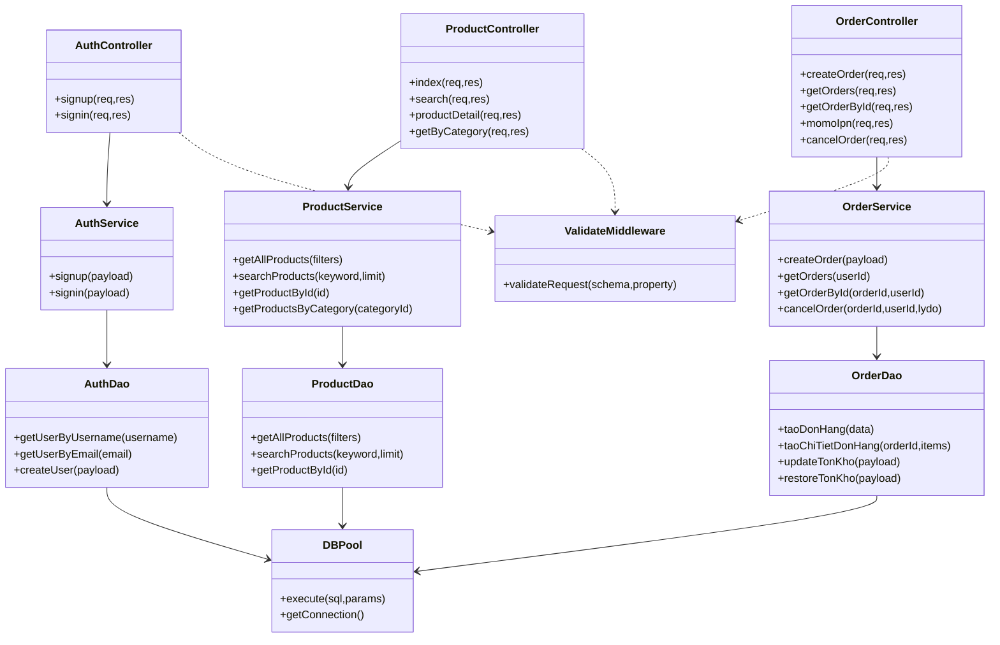

# Class Diagram Data

## Scope
Codebase la JavaScript function-style, vi vay class diagram duoc mo hinh hoa theo "logical classes" dai dien cho layer.

## Class List
| Class ID | Logical Class | Layer | Responsibility |
|---|---|---|---|
| CLS_AuthController | AuthController | Controller | Nhan req auth va tra response |
| CLS_AuthService | AuthService | Service | Nghiep vu dang ky/dang nhap |
| CLS_AuthDao | AuthDao | DAO | SQL users cho auth |
| CLS_ProductController | ProductController | Controller | API product list/search/detail |
| CLS_ProductService | ProductService | Service | Nghiep vu product |
| CLS_ProductDao | ProductDao | DAO | SQL product/variant/category |
| CLS_OrderController | OrderController | Controller | Tao/list/detail/huy don + momo ipn |
| CLS_OrderService | OrderService | Service | Nghiep vu dat hang/thanh toan |
| CLS_OrderDao | OrderDao | DAO | SQL don hang + chi tiet + ton kho |
| CLS_AdminController | AdminController | Controller | Entry controller cho admin modules |
| CLS_AdminOrderService | AdminOrderService | Service | Quan ly trang thai don admin |
| CLS_AdminProductService | AdminProductService | Service | CRUD san pham admin |
| CLS_AdminCategoryService | AdminCategoryService | Service | CRUD danh muc admin |
| CLS_AdminImportService | AdminImportService | Service | Tao phieu nhap + cong ton transaction |
| CLS_ValidateMiddleware | ValidateMiddleware | Middleware | Kiem tra schema dau vao |
| CLS_DBPool | DBPool | Infra | Pool connect va execute query |

## Representative Methods
| Logical Class | Method Name | Input | Output |
|---|---|---|---|
| AuthController | signup(req,res) | req.body | json response |
| AuthController | signin(req,res) | req.body | json response |
| AuthService | signup(payload) | username/password/email/... | user data |
| AuthService | signin(payload) | username/password | user session data |
| AuthDao | getUserByUsername(username) | username | user row/null |
| ProductController | index(req,res) | query params | product list |
| ProductController | search(req,res) | keyword, limit | matched products |
| ProductService | getAllProducts(filters) | filters | rows |
| ProductDao | getProductById(id) | id | product detail |
| OrderController | createOrder(req,res) | order payload | order result/payUrl |
| OrderController | momoIpn(req,res) | ipn payload | ack/status |
| OrderService | createOrder(data) | user + items + payment | new order |
| OrderService | cancelOrder(id,user,lydo) | ids + reason | updated order |
| OrderDao | taoDonHang(data) | normalized order | insert id |
| OrderDao | taoChiTietDonHang(orderId,items) | order id + items | inserted rows |
| ValidateMiddleware | validateRequest(schema,property) | schema + body/query | next/error |
| DBPool | execute(sql,params) | sql + params | rows/result |

## Relationships
| From | To | Relation | Description |
|---|---|---|---|
| CLS_AuthController | CLS_AuthService | uses | Controller goi service auth |
| CLS_AuthService | CLS_AuthDao | uses | Service goi DAO auth |
| CLS_ProductController | CLS_ProductService | uses | Controller goi service product |
| CLS_ProductService | CLS_ProductDao | uses | Service goi DAO product |
| CLS_OrderController | CLS_OrderService | uses | Controller goi service order |
| CLS_OrderService | CLS_OrderDao | uses | Service goi DAO order |
| CLS_AdminController | CLS_AdminOrderService | aggregates | Controller admin gom nhieu domain service |
| CLS_AdminController | CLS_AdminProductService | aggregates | Controller admin gom nhieu domain service |
| CLS_AdminController | CLS_AdminCategoryService | aggregates | Controller admin gom nhieu domain service |
| CLS_AdminController | CLS_AdminImportService | aggregates | Controller admin gom nhieu domain service |
| CLS_AuthDao | CLS_DBPool | depends on | DAO su dung pool |
| CLS_ProductDao | CLS_DBPool | depends on | DAO su dung pool |
| CLS_OrderDao | CLS_DBPool | depends on | DAO su dung pool |
| CLS_AuthController | CLS_ValidateMiddleware | constrained by | Route chain middleware validate |
| CLS_ProductController | CLS_ValidateMiddleware | constrained by | Route chain middleware validate |
| CLS_OrderController | CLS_ValidateMiddleware | constrained by | Route chain middleware validate |

## Suggested Attributes (de ve class box)
| Logical Class | Attributes |
|---|---|
| AuthService | authDao, bcrypt |
| ProductService | productDao |
| OrderService | orderDao, momoService |
| AdminImportService | importDao, stockDao, dbTransaction |
| DBPool | host, user, password, database, connectionLimit |

## Mermaid Seed

## Narrative Notes
- Day la class diagram logic (khong phai class syntax OOP thuần).
- Trinh bay theo layer se de duoc giang vien chap nhan vi phu hop cau truc code JS hien tai.
- Neu can sat source 100%, co the doi ten method theo file controller/service/dao tuong ung.