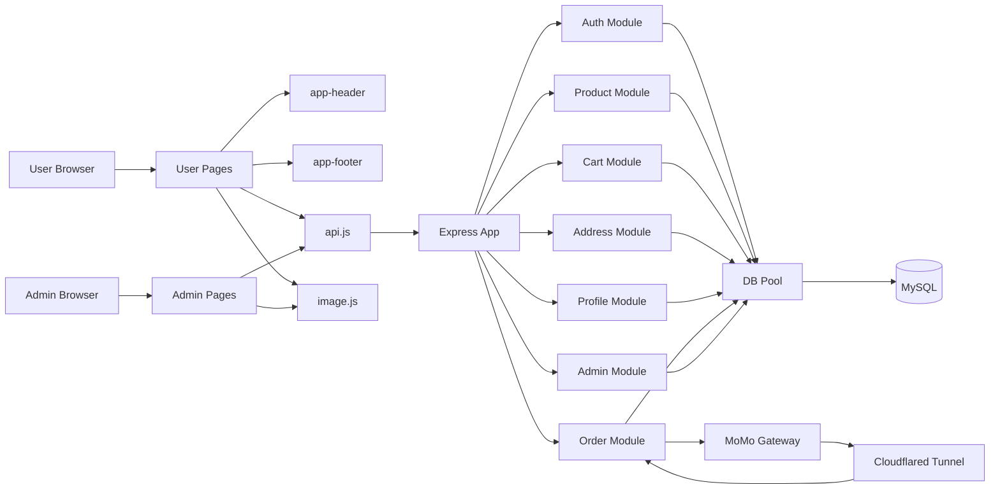

# Component Diagram Data

## Scope
Mo ta thanh phan runtime tu frontend den backend va he thong ngoai.

## Node List
| ID | Name | Type | Description |
|---|---|---|---|
| ACT_USER | User Browser | actor | Nguoi dung mua hang |
| ACT_ADMIN | Admin Browser | actor | Nguoi quan tri |
| CMP_HEADER | app-header | component | Header co search |
| CMP_FOOTER | app-footer | component | Footer dung chung |
| CMP_PAGES_USER | User Pages | component | auth/product/cart/checkout/profile |
| CMP_PAGES_ADMIN | Admin Pages | component | dashboard/order/category/product/stock/import |
| CMP_API | assets/js/api.js | component | API client wrapper |
| CMP_IMAGE | assets/js/image.js | component | Build image url helper |
| CMP_EXPRESS | Express App | component | index.js + router mounting |
| CMP_AUTH | Auth Module | component | Dang ky/dang nhap |
| CMP_PRODUCT | Product Module | component | Product list/search/detail |
| CMP_CART | Cart Module | component | Gio hang CRUD |
| CMP_ADDRESS | Address Module | component | Dia chi giao hang |
| CMP_PROFILE | Profile Module | component | Profile + avatar |
| CMP_ORDER | Order Module | component | Tao don/list/detail/huy/momo ipn |
| CMP_ADMIN | Admin Module | component | Dashboard + quan ly admin |
| CMP_DBPOOL | DB Pool | component | mysql2/promise pool |
| CMP_DB | MySQL | database | Schema btapweb_v2 |
| CMP_MOMO | MoMo Gateway | external | Cong thanh toan sandbox |
| CMP_TUNNEL | Cloudflared Tunnel | external | Expose callback local |

## Edge List
| From | To | Interface | Protocol |
|---|---|---|---|
| ACT_USER | CMP_PAGES_USER | UI interaction | Browser event |
| ACT_ADMIN | CMP_PAGES_ADMIN | UI interaction | Browser event |
| CMP_PAGES_USER | CMP_HEADER | shared layout | DOM |
| CMP_PAGES_USER | CMP_FOOTER | shared layout | DOM |
| CMP_PAGES_USER | CMP_API | invoke api | HTTP/JSON |
| CMP_PAGES_ADMIN | CMP_API | invoke api | HTTP/JSON |
| CMP_PAGES_USER | CMP_IMAGE | render image | helper call |
| CMP_PAGES_ADMIN | CMP_IMAGE | render image | helper call |
| CMP_API | CMP_EXPRESS | call rest endpoints | HTTP |
| CMP_EXPRESS | CMP_AUTH | /api/auth | router dispatch |
| CMP_EXPRESS | CMP_PRODUCT | /api/products | router dispatch |
| CMP_EXPRESS | CMP_CART | /api/cart | router dispatch |
| CMP_EXPRESS | CMP_ADDRESS | /api/address | router dispatch |
| CMP_EXPRESS | CMP_PROFILE | /api/profile | router dispatch |
| CMP_EXPRESS | CMP_ORDER | /api/orders | router dispatch |
| CMP_EXPRESS | CMP_ADMIN | /api/admin | router dispatch |
| CMP_AUTH | CMP_DBPOOL | query users | mysql2 |
| CMP_PRODUCT | CMP_DBPOOL | query product/variant | mysql2 |
| CMP_CART | CMP_DBPOOL | query cart | mysql2 |
| CMP_ADDRESS | CMP_DBPOOL | query address | mysql2 |
| CMP_PROFILE | CMP_DBPOOL | query user profile | mysql2 |
| CMP_ORDER | CMP_DBPOOL | create/update order | mysql2 |
| CMP_ADMIN | CMP_DBPOOL | admin query/report | mysql2 |
| CMP_DBPOOL | CMP_DB | execute sql | TCP 3306 |
| CMP_ORDER | CMP_MOMO | payment request/signature | HTTPS |
| CMP_MOMO | CMP_TUNNEL | callback forwarding | HTTPS |
| CMP_TUNNEL | CMP_ORDER | ipn/return callback | HTTPS |

## API Boundaries
| Component | Endpoints |
|---|---|
| CMP_AUTH | POST /api/auth/signup, POST /api/auth/signin |
| CMP_PRODUCT | GET /api/products, /search, /:id, /category/:category_id |
| CMP_CART | GET/POST/PUT/DELETE /api/cart |
| CMP_ADDRESS | GET/POST/PATCH/GET:id/PUT:id/DELETE:id /api/address |
| CMP_PROFILE | POST /api/profile/avatar, GET /api/profile/:id, PUT /api/profile |
| CMP_ORDER | POST /api/orders, POST /api/orders/momo/ipn, GET /api/orders, GET /api/orders/:id, PATCH /api/orders/:id/cancel |
| CMP_ADMIN | 20 endpoint trong /api/admin |

## Mermaid Seed

## Narrative Notes
- Co the ve 2 lane actor: User va Admin.
- Dat API helper giua Page va Express App de lam ro frontend architecture.
- Tach Order Module rieng vi co ket noi voi component external (MoMo).