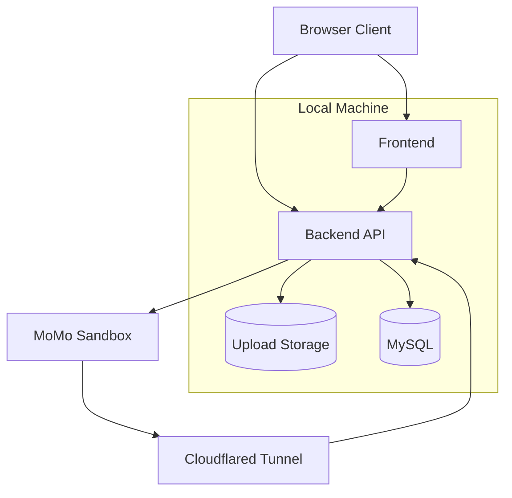
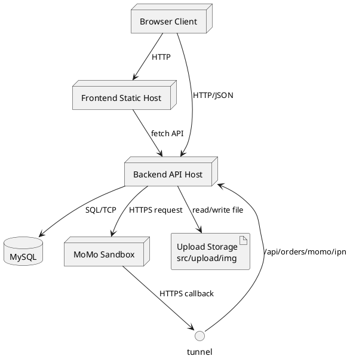

# Deployment Diagram Data

## Scope
Mo ta cach trien khai he thong tren moi truong local dev co tich hop MoMo sandbox.

## Node List
| ID | Name | Type | Runtime/Port | Description |
|---|---|---|---|---|
| DEP_CLIENT | Browser Client | node | N/A | User/Admin truy cap giao dien va API |
| DEP_FE | Frontend Static Host | node | localhost:8000 | Serve html/css/js trong thu muc fontend |
| DEP_BE | Backend API Host | node | localhost:3000 | Node.js Express API server |
| DEP_UPLOAD | Upload Storage | artifact | local folder | Luu file anh upload |
| DEP_DB | MySQL Server | node | 127.0.0.1:3306 | CSDL btapweb_v2 |
| DEP_MOMO | MoMo Sandbox | external node | HTTPS | Cong thanh toan ngoai he thong |
| DEP_TUNNEL | Cloudflared Tunnel | edge node | HTTPS tunnel | Forward callback vao local backend |

## Artifact List
| Artifact | Deployed On | Source |
|---|---|---|
| HTML/CSS/JS pages | DEP_FE | fontend/pages + fontend/assets |
| API application | DEP_BE | index.js + src/* |
| Uploaded images | DEP_UPLOAD | src/upload/img |
| SQL schema/data | DEP_DB | sql_v2.sql |

## Connection List
| From | To | Label | Protocol |
|---|---|---|---|
| DEP_CLIENT | DEP_FE | tai giao dien | HTTP |
| DEP_CLIENT | DEP_BE | goi API truc tiep | HTTP/JSON |
| DEP_FE | DEP_BE | api helper fetch | HTTP/JSON |
| DEP_BE | DEP_DB | execute SQL query | TCP 3306 |
| DEP_BE | DEP_UPLOAD | read/write image file | local fs |
| DEP_BE | DEP_MOMO | create payment request | HTTPS |
| DEP_MOMO | DEP_TUNNEL | callback return/ipn | HTTPS |
| DEP_TUNNEL | DEP_BE | forward callback /api/orders/momo/ipn | HTTPS |

## Security/Config Notes
- DB config hien tai nam trong src/config/config.json.
- MoMo key/secret dang trong service va nen externalize qua env.
- CORS duoc bat tren backend de frontend local goi API.

## Mermaid Seed

## PlantUML Seed (optional)

## Narrative Notes
- Deployment diagram nen tach 3 cum: client, local host, external service.
- Nhan manh callback channel tu MoMo ve backend qua tunnel khi demo local.
- Neu trien khai production, thay DEP_FE/DEP_BE bang web server + app server cloud.