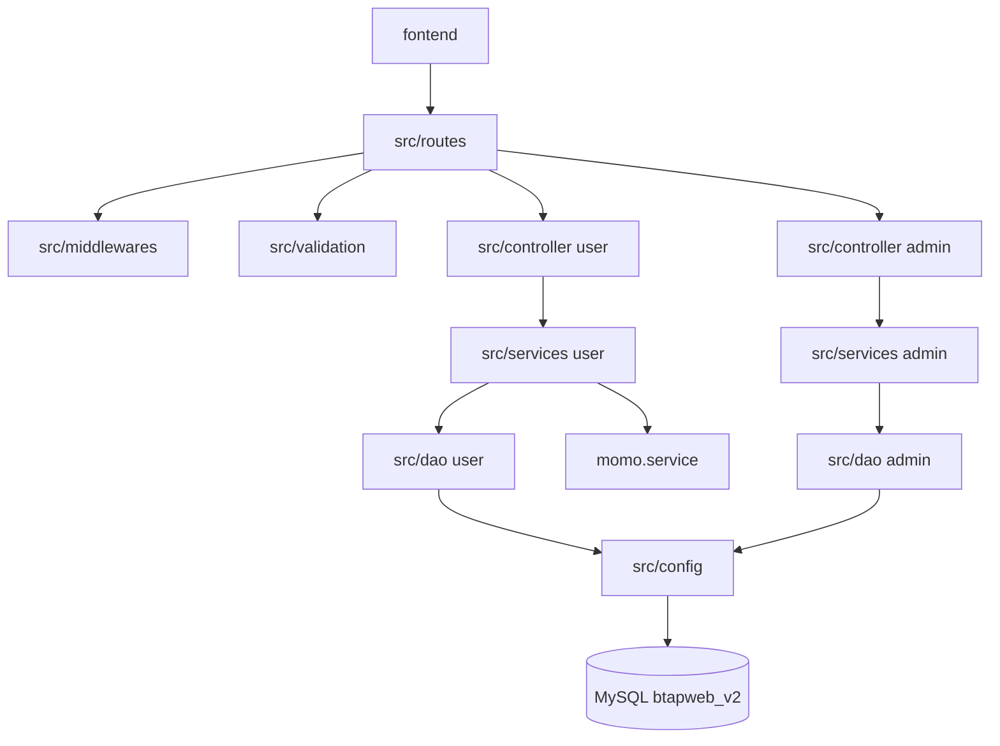

# Package Diagram Data

## Scope
Mo ta kien truc package theo mo hinh layer:
route -> middleware/validation -> controller -> service -> dao -> db

## Node List
| ID | Name | Type | Description |
|---|---|---|---|
| PKG_FE | fontend | package | Giao dien da trang (html/css/js) |
| PKG_ROUTE | src/routes | package | Dinh nghia endpoint API |
| PKG_MW | src/middlewares | package | Middleware chung (validate, upload, xu ly loi) |
| PKG_VAL | src/validation | package | Joi schema validate request |
| PKG_CTRL_USER | src/controller (user) | package | Controller user modules |
| PKG_CTRL_ADMIN | src/controller/admin | package | Controller admin modules |
| PKG_SVC_USER | src/services (user) | package | Business logic user |
| PKG_SVC_ADMIN | src/services/admin | package | Business logic admin |
| PKG_DAO_USER | src/dao (user) | package | SQL query user modules |
| PKG_DAO_ADMIN | src/dao/admin | package | SQL query admin modules |
| PKG_CFG | src/config | package | DB config va pool |
| PKG_DB | MySQL btapweb_v2 | database | Du lieu nghiep vu |
| PKG_PAY | src/services/momo.service.js | package | Tich hop thanh toan MoMo |

## Edge List
| From | To | Label | Direction |
|---|---|---|---|
| PKG_FE | PKG_ROUTE | HTTP API call | PKG_FE -> PKG_ROUTE |
| PKG_ROUTE | PKG_MW | middleware chain | PKG_ROUTE -> PKG_MW |
| PKG_ROUTE | PKG_VAL | input validation | PKG_ROUTE -> PKG_VAL |
| PKG_ROUTE | PKG_CTRL_USER | user endpoint handler | PKG_ROUTE -> PKG_CTRL_USER |
| PKG_ROUTE | PKG_CTRL_ADMIN | admin endpoint handler | PKG_ROUTE -> PKG_CTRL_ADMIN |
| PKG_CTRL_USER | PKG_SVC_USER | call business logic | PKG_CTRL_USER -> PKG_SVC_USER |
| PKG_CTRL_ADMIN | PKG_SVC_ADMIN | call business logic | PKG_CTRL_ADMIN -> PKG_SVC_ADMIN |
| PKG_SVC_USER | PKG_DAO_USER | query data | PKG_SVC_USER -> PKG_DAO_USER |
| PKG_SVC_ADMIN | PKG_DAO_ADMIN | query data | PKG_SVC_ADMIN -> PKG_DAO_ADMIN |
| PKG_DAO_USER | PKG_CFG | use db pool | PKG_DAO_USER -> PKG_CFG |
| PKG_DAO_ADMIN | PKG_CFG | use db pool | PKG_DAO_ADMIN -> PKG_CFG |
| PKG_CFG | PKG_DB | SQL execute | PKG_CFG -> PKG_DB |
| PKG_SVC_USER | PKG_PAY | create/check momo payment | PKG_SVC_USER -> PKG_PAY |

## Package Groups de dua vao hinh
| Group | Thanh phan |
|---|---|
| User Domain | auth, product, cart, address, profile, order |
| Admin Domain | dashboard, order, category, product, stock, import |
| Infra | config, db pool, upload folder |
| External | momo gateway |

## Route Inventory (tham chieu nhanh)
- src/routes/auth.route.js
- src/routes/product.route.js
- src/routes/cart.route.js
- src/routes/address.route.js
- src/routes/profile.route.js
- src/routes/order.route.js
- src/routes/admin.route.js

## Mermaid Seed

## Narrative Notes
- Package diagram nen nhan manh 2 cum chinh: User module va Admin module.
- Tan tang middleware/validation de giai thich kiem soat input.
- Dat DB va MoMo ben ngoai cum service de the hien dependency huong ngoai.